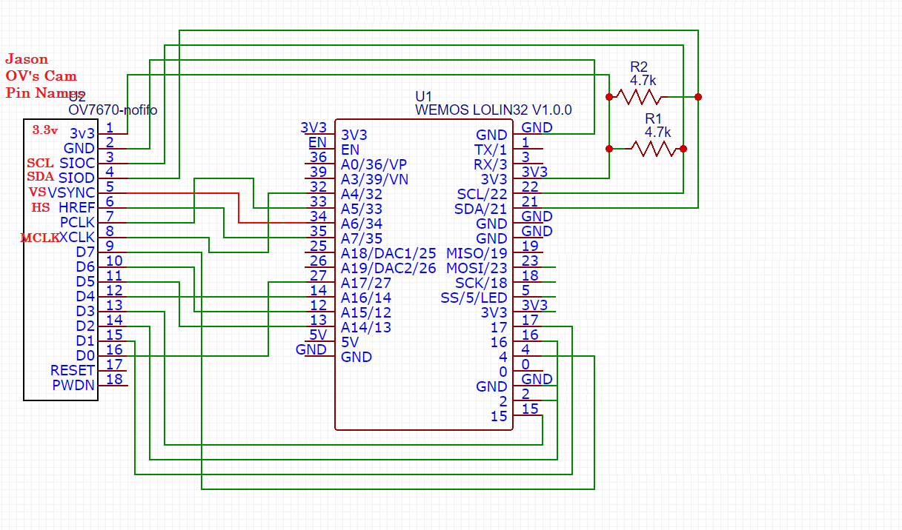

# ESP 32 & OV 7670 Camera Module ( No FIFO )
## ESP 32 Wifi Server (HTTP Server, serving HTML & Bitmaps of images captured with Camera Module)

- This is one of the main technical challenges I need to solve for my object scanner project that will be publicly available on github soon...
- This attempt **wasn't** a success due to the poor quality of bitmap that the OV7670 was capturing & displaying.
- Nevertheless, was a great learning experience and lots of fun!

Here's a small showcase:
[https://youtu.be/EvHdvr4vhDo](https://youtu.be/EvHdvr4vhDo)

## Components I used:
| Technical Name | General Description | Purchase Link |
| ----------- | ----------- |----------- |
| HiLetgo ESP-WROOM-32 ESP32 ESP-32D | Price on Amazon: ~20$ CAD, Good Chip, Dual Core Micro Processor, Antenna WiFi module, Arduino IDE compatible| [Amazon Link](https://www.amazon.ca/gp/product/B0718T232Z/ref=ppx_yo_dt_b_asin_image_o04_s00?ie=UTF8&psc=1)| 
| 640 x 480 CMOS OV7670 Camera Module Lens |Price on Amazon: ~15$ CAD, Cheap but you get what you paid for... 8 Digital Out Pins for passing Camera data to micro-controller| [Amazon Link](https://www.amazon.ca/gp/product/B008D8PMA4/ref=ppx_yo_dt_b_search_asin_image?ie=UTF8&psc=1)|
| Jumpers | Regular M-M , F-F & M-F jumper wires | n/a |
| Mini Breadboard | n/a | n/a |
| 2x Resistors | I tried lots of different resistances; 5.1k , 4.7k , 4k & 1k for the Resistors on the I2S output pins | n/a |
| Micro-USB Cable **with Data Transfer** | Note: Lots of android phone chargers don't support data transfer only power transfer | n/a |

##Diagrams:

##Simplified Circuit Diagram (ESP32 connections with OV7670)

##Web Connectivity Diagram (ESP32 running HTTP Server & Client connecting via IPv4 localhost IP)
