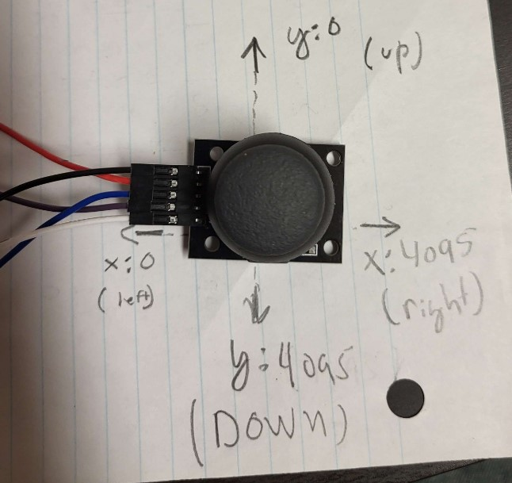
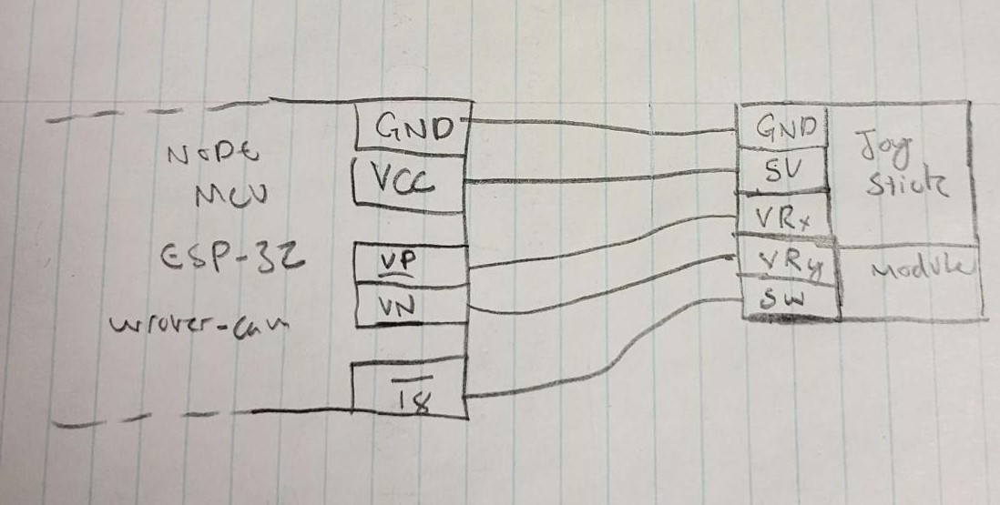
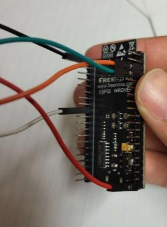

## Connecting ESP32 Wrover-Cam (from Freenove) with generic ELEGOO Joystick 

The Joystick module is basically just 2 potentiometers *(X & Y axis variable resistance based on which direction it's currently displaced)* , and additionally this module has a built in button click which is a digital input. 

**Code Notes**
The inputs from the X & Y of the Joystick are received as analog inputs, and can be immediately interpreted into integers. View the diagram below for the integer ranges denoting in which position the joystick is currently in.

**On X-Axis:** 0 indicates completely *LEFT* , 4095 indicates completely *RIGHT*
**On Y-Axis:** 0 indicates completely *UP* , 4095 indicates completely *DOWN*

The button on the joystick is abstracted thanks to the `ezButton` library which handles debounce, noise, keeps track of button state *(So that the system doesn't think a button hold is actually 2 clicks)* and more. Kudos to [ezButton](https://github.com/ArduinoGetStarted/button) for easy state tracking of Joystick button.

*Note: should probably implement a more bare-bones version of this in 3d-obj-scanner project*

## Hardware Diagram & Pictures

