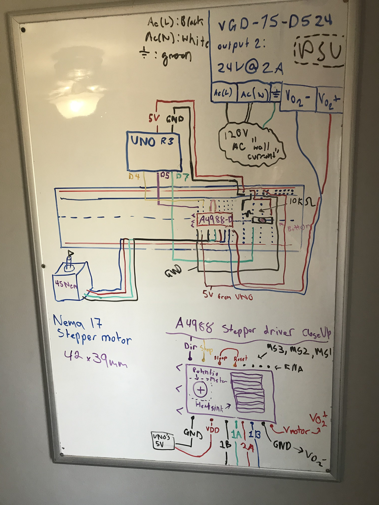
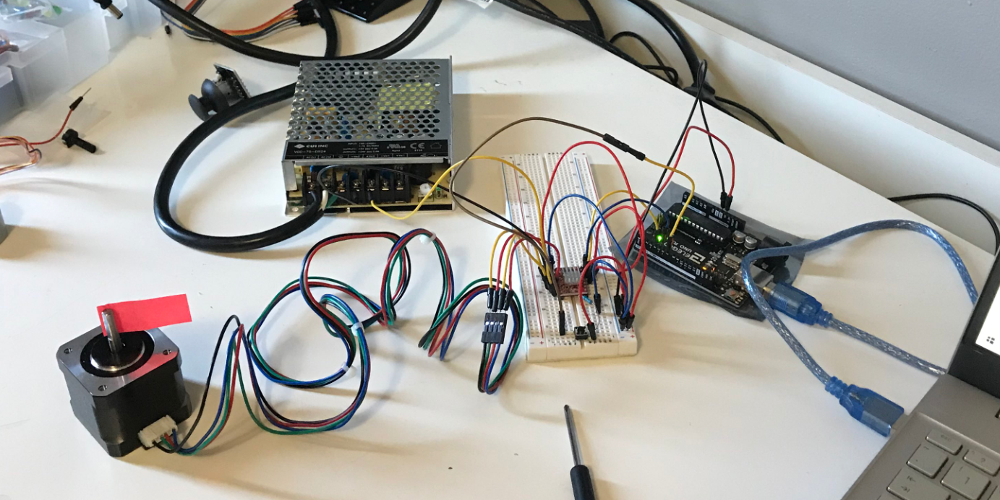
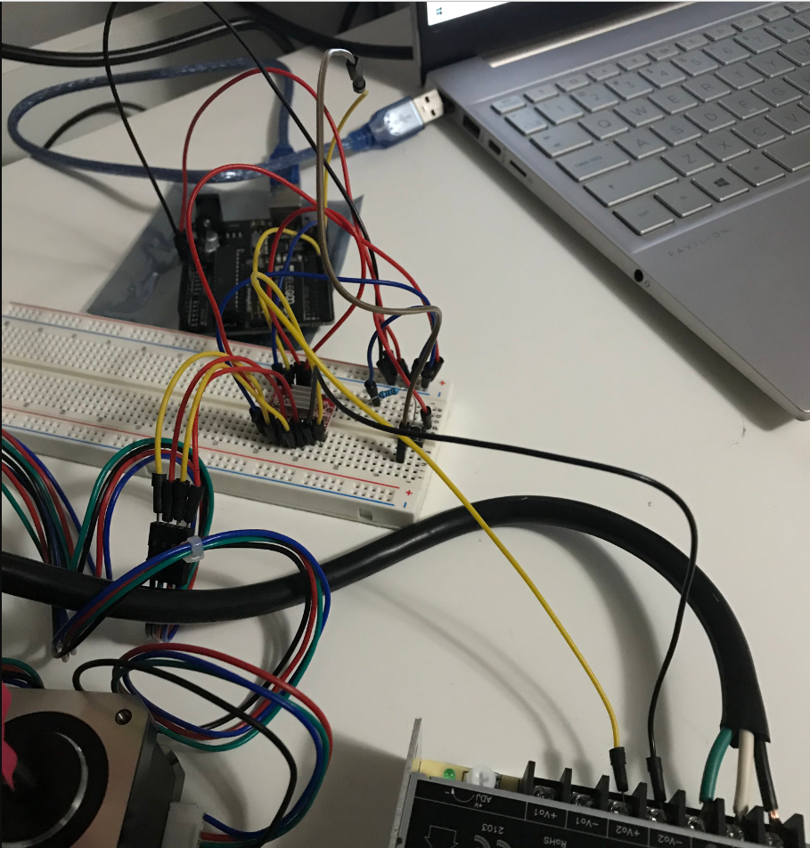
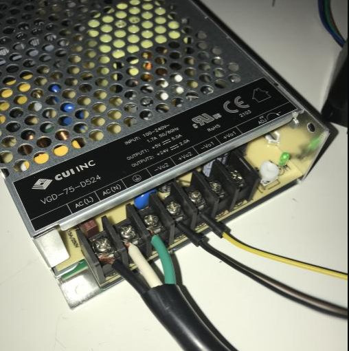

# Basic Logic Gate with Nema 17 Stepper Motor

This machine utilizes a button input to set the attached module (the motor) into 1 of 2 states. This stepper motor is wired to an *A4988 Stepstick Stepper Motor Driver Module*. The A4988 then communicates to the Arduino Microcontroller via 2 digital pins.

Here's a small showcase:
[https://youtu.be/iGbHXvfwF40](https://youtu.be/iGbHXvfwF40)

## Components I used:
| Technical Name | General Description |
| ----------- | ----------- |
| Elegoo UNO R3      | Microcontroller board (based on the Microchip ATmega328P)       |
| 830 Tie-Points Breadboard   | Breadboard for connecting components to power loop & UNO pins   |
| 3 Pin wide Button      | Used as a boolean input for the state of movement for the Stepper Motor |
| Resistor 10K ohms | Hooked up in series with the button ( I guess it's so no current passes when LOW only until button is sending HI signal ) |
| Nema 17 Stepper Motor 45Ncm 42x39mm| 12V , 1.5 A , 4 Leads (forwarded to A4988 driver), Item weight: 280 grams (For Torque calculations) |
| A4988 Stepstick Stepper Motor Driver Module  | Used as a driver for the Nema 17 Stepper Motor's functionality and electricity forwarding, A4988 communicates with 2 digital pins of the arduino board aswell. |
| Ultrasonic Sensor     | Used to detect the distance of objects directly in-line with the sensor (At varying distances)   |
| VGD-75-D524 Power Supply| INPUT: `90 - 264 V AC ` , ` 120 - 373 V DC` OUTPUT: `V1: 5V , 5A` , `V2: 24V 2A` used for supplying power to motor |
| NEMA 5-15P type plug | Used a 3 pin (NEMA 5-15P type) plug which I cut and striped for the 3 wires connecting to the motors power supply (Black,white,green) |

## Hardware Diagram: 
  

Picture of the setup for reference:

## Code setup:

* Very simple code, no external libraries where needed, the A4988 simply dealt with HI or LOW inputs for the direction and step pins, therefore `digitalWrite( pin, state)` was enough to fully control the stepper motor.

## Ressources that helped me:

[How To Control a Stepper Motor with A4988 Driver and Arduino (How to Mechatronics)](https://www.youtube.com/watch?v=5CmjB4WF5XA)  
[Mr Innovative A9488 nema 17 tutorial](https://www.youtube.com/watch?v=_5H7ibWQgXo)  
[My question about VGD power supply on electrical engineering stack exchange](https://electronics.stackexchange.com/questions/636030/how-do-i-hook-up-my-power-supply-to-an-outlet)  

### I'm releasing new projects involving a stepper motor so I wanted to get one setup and familiarized. 

