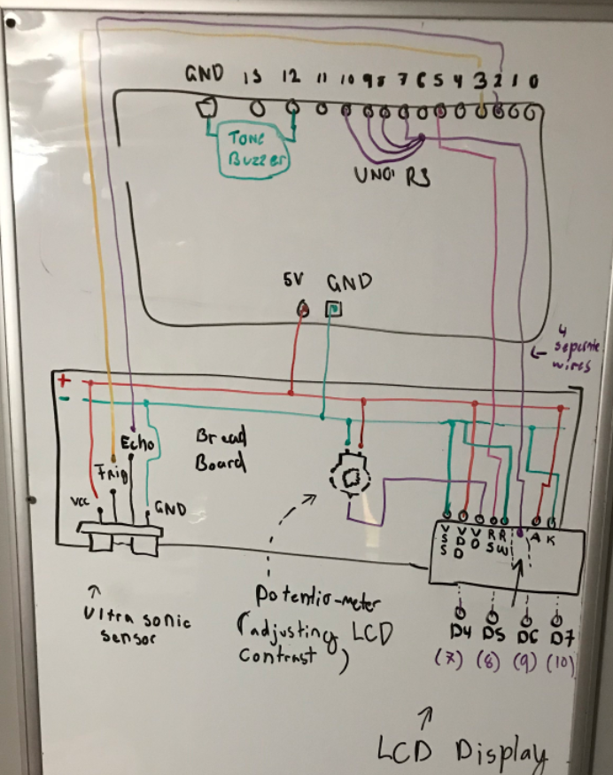

# Distance Sensitive Indicator 
## (improper title: The Goldie Lox Machine)

This contraption basically senses an object with an Ultrasonic sensor, when the object is deemed to far, it displays the caption ` TOO FAR ` message (along with some custom text manip), when the object is detected to be too close, it will display ` TOO CLOSE ` and at the sweet spot (hence the name) it will display a success message along with a low-medium frequency buzzing from a passive buzzer.

Here's a small showcase:
[https://youtu.be/eAadxTLQJWQ](https://youtu.be/eAadxTLQJWQ)

## Components I used:
| Technical Name | General Description |
| ----------- | ----------- |
| Elegoo UNO R3      | Microcontroller board (based on the Microchip ATmega328P)       |
| 830 Tie-Points Breadboard   | Breadboard for connecting components to power loop & UNO pins   |
| Passive Buzzer      | Used to generate a tone at a certain frequency (using `tone()` & `noTone()` built-ins)       |
| LCD1602 Module (with pin header)      | LCD Display used to tell the user if their distance was acceptable or not.      |
| Ultrasonic Sensor     | Used to detect the distance of objects directly in-line with the sensor (At varying distances)   |
| Potentiometer 10K | The potentio-meter was used to adjust the contrast on the LCD display's screen, this was connected to the V0 pin of the LCD |

## Hardware Diagram: 
Rough drawing, but replicates the wiring structure.
  

## Code setup:

* Only using the LiquidCrystal library for adding high-level functionality to the otherwise low-level LCD display.
* The 2 other functions are simply caption formatters for the LCD display (Wether it blinks random characters at each end, or scrolls horizontally)
* Buzzer & Ultrasonic sensor wrapper functions are built-in by default. (No libs for those)

This was my first legitmate arduino project. Had lots of fun with it.

